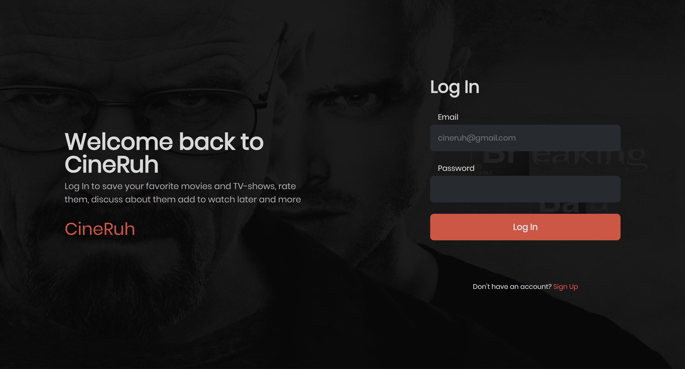
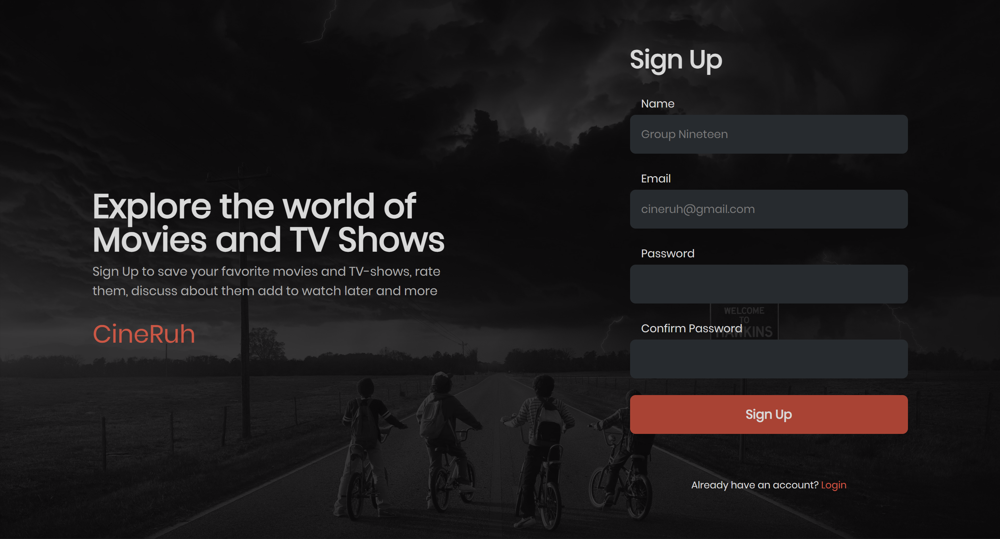
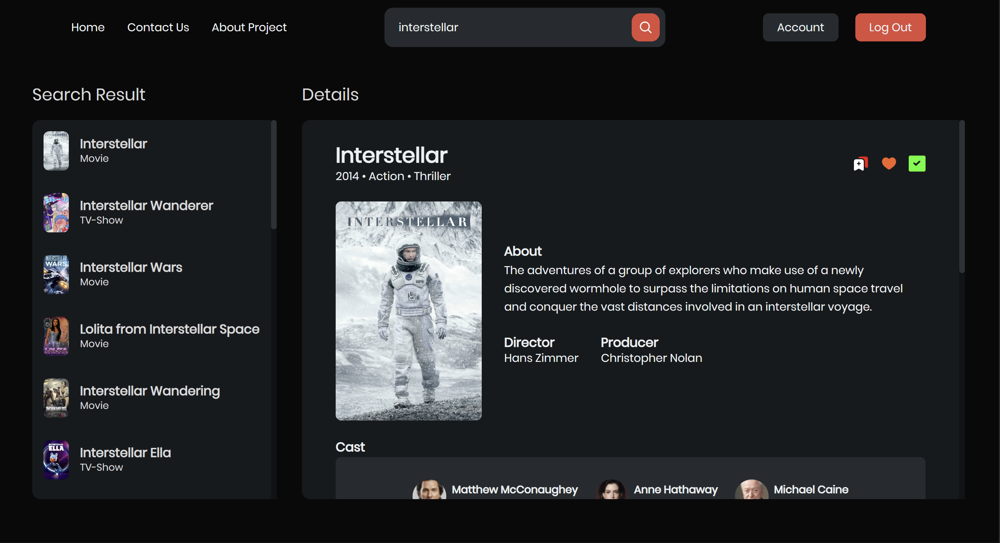
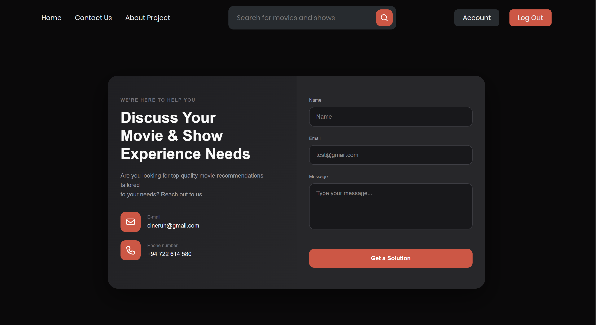
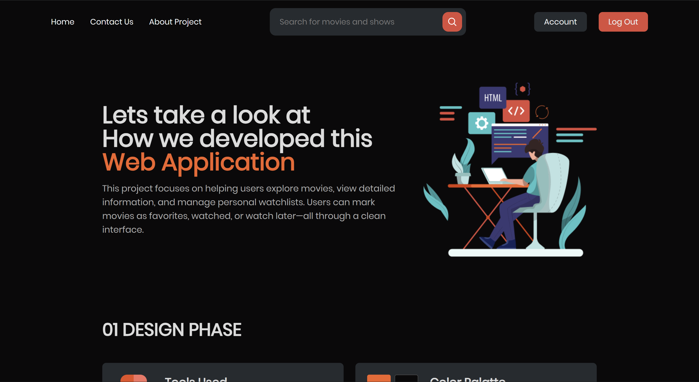
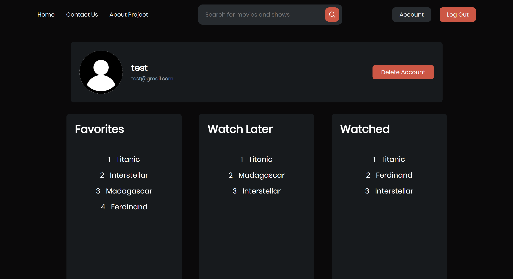

# CineRUH 🎬

CineRUH is a web platform that allows users to create accounts, search for movies, and manage their personal movie lists. Users can add movies to **Favorites**, **Watched**, and **Watch Later** lists.  

This project was developed as our **1st Year, 1st Semester** project for **University of Ruhuna**.

---

## 📸 Screenshots

### Login Page

### Signup Page

### Home Page

### Contact Us Page

### About Project Page

### Account Page

---

## 📝 Features

- **User Authentication**: Signup and Login
- **Search Movies**: Search by title
- **Personal Lists**:
  - Add movies to Favorites
  - Add movies to Watched
  - Add movies to Watch Later
- **Responsive Design**: Works across devices
- **Interactive UI**: Modern design and easy navigation

---

## 🔖 Project Versions

| Version | Description |
|---------|-------------|
| **main** | Initial web page designs only |
| **version1** | Initial backend implementation |
| **version2** | Deployed version with demo for university submission |
Upcoming>>
|**version3** | Separation of Home and Search page, better UI with better User account page | 
|**version4** | AI chat bot for get suggetion | 

---

## 🎨 Figma Design

You can view the UI/UX design in Figma here:  
(https://www.figma.com/design/pnEjTAU89WoWSO0AX7wBf1/CSC113a-Project?node-id=0-1&t=9Gly9iDvE1QdQLS2-1)

---

## 📂 Project Structure

CineRUH  
├── screenshots/ 
├── backend/ # Backend code (version1 onwards) 
├── movie-app/ # Frontend code 
├── README.md 
└── ...other files 

---

## ℹ️ About the Project

CineRUH was developed to give movie enthusiasts an easy way to manage and track their movies. It focuses on simplicity, usability, and user engagement.  

During this project, we learned:

- Full-stack web development
- Backend API implementation
- Database management
- UI/UX design with Figma

---

## 📞 Contact Us

If you have any questions or suggestions, feel free to contact us:

- **Pasindu Manahara** – [manahara2003@gmail.com](mailto:email@example.com)  
- **Dulith Siriwardane** – [dulithsocialmedia@gmail.com](mailto:email@example.com)  

---

## ⚡ Technologies Used

- **Frontend:** React / Tail-Wind CSS*  
- **Backend:** PHP *  
- **Database:** MySQL*  
- **UI/UX Design:** Figma  

---

## 🚀 How to Run Locally

1. Clone the repository:

git clone https://github.com/pasindumanahara/CineRUH.git

2. Navigate to the project folder:

cd CineRUH

3. Install dependencies:

npm install

4. Run the backend:

npm start

You need XAMPP or Apache server to run the backend,
Copy paste backend files to the htdocs folder or change 
file path to the relavant location.

